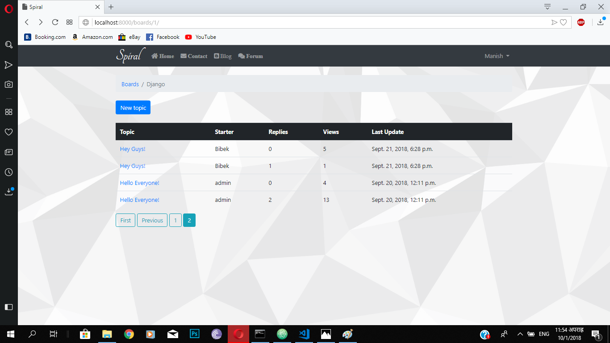

# Overview
This spiral web-project is a blog, forum style of an web- application built with Django Framework where user can write different post, start a new discussion by creating a new topic.. This can be blog post , twitter updates,etc. In several topics, other users can engage in the discussion posting replies.


## Login Page & HomePage
|                          |                        |
| -------------------------:|:------------------------- |
|   |   |
|   |   |


To run this spiral web application in your localhost:

As I've said earlier this project is built in Django Framework. You'll need [python](https://www.python.org/downloads/) 3.x 0r higher on your desktop/laptop to run this website.

Installation of Django Framework:
```bash
    pip install django
```

Install required packages:
```bash
    pip install django-crispy-forms
    pip install pillow
    pip install markdown
```

Create a superuser to access the database:
```bash
    python manage.py createsuperuser
```

Initialize Databse:
```bash
    python manage.py makemigrations
    python manage.py migrate
```

Check for database migrations:
```bash
    python manage.py showmigrations
```

To view the website, run the development server https://127.0.0.1/
```bash
    python manage.py runserver
```


## Blog and Forum:
|            Blog           |           Forum           |
| -------------------------:|:------------------------- |
|   |   |
|   |   |
|   |   |
